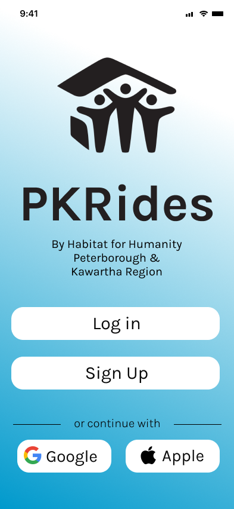

<a name="readme-top"></a>

<!-- PROJECT SHIELDS -->
<!--
*** I'm using markdown "reference style" links for readability.
*** Reference links are enclosed in brackets [ ] instead of parentheses ( ).
*** See the bottom of this document for the declaration of the reference variables
*** for contributors-url, forks-url, etc. This is an optional, concise syntax you may use.
*** https://www.markdownguide.org/basic-syntax/#reference-style-links
-->

[![Contributors][contributors-shield]][contributors-url]
[![Forks][forks-shield]][forks-url]
[![Stargazers][stars-shield]][stars-url]
[![Issues][issues-shield]][issues-url]
[![MIT License][license-shield]][license-url]
[![LinkedIn][linkedin-shield]][linkedin-url]

<!-- PROJECT LOGO -->
<br />
<div align="center">
  <a href="https://github.com/TheDevRatt/habitat-pkr-app">
    
  </a>

<h3 align="center">PKRides</h3>

  <p align="center">
  An innovative car-sharing platform designed to support Habitat for Humanity Peterborough & Kawartha Region homeowners!
    <br />
    <a href="https://github.com/TheDevRatt/habitat-pkr-app"><strong>Explore the docs »</strong></a>
    <br />
    <br />
    <a href="https://github.com/TheDevRatt/habitat-pkr-app">View Demo</a>
    ·
    <a href="https://github.com/TheDevRatt/habitat-pkr-app/issues">Report Bug</a>
    ·
    <a href="https://github.com/TheDevRatt/habitat-pkr-app/issues">Request Feature</a>
  </p>
</div>

<!-- TABLE OF CONTENTS -->
<details>
  <summary>Table of Contents</summary>
  <ol>
    <li>
      <a href="#about-the-project">About The Project</a>
      <ul>
        <li><a href="#built-with">Built With</a></li>
      </ul>
    </li>
    <li>
      <a href="#getting-started">Getting Started</a>
      <ul>
        <li><a href="#prerequisites">Prerequisites</a></li>
        <li><a href="#installation">Installation</a></li>
      </ul>
    </li>
    <li><a href="#usage">Usage</a></li>
    <li><a href="#roadmap">Roadmap</a></li>
    <li><a href="#contributing">Contributing</a></li>
    <li><a href="#license">License</a></li>
    <li><a href="#contact">Contact</a></li>
    <li><a href="#acknowledgments">Acknowledgments</a></li>
  </ol>
</details>

<!-- ABOUT THE PROJECT -->

## About The Project

<p align="center">
  
</p>

Connectivity and Sustainability are the cornerstones of any successful initiative and PKRides aims to foster both along with a driven community among Habitat for Humanity Peterborough & Kawartha Region homeowners. This project, born from a collaboration with Trent University's COIS-4000Y capstone course, introduces a novel car-sharing solution aimed at alleviating transportation costs, optimizing space for housing development, and promoting environmental stewardship. It embodies our commitment in working with Habitat for Humanity in not just building homes, but also nurturing a supportive and resource-efficient community, reinforcing the mission ensuring everyone has a decent place to live.

<p align="right">(<a href="#readme-top">back to top</a>)</p>

### Built With

- [![Next][Next.js]][Next-url]
- [![React][React.js]][React-url]
- [![Vue][Vue.js]][Vue-url]
- [![Angular][Angular.io]][Angular-url]
- [![Svelte][Svelte.dev]][Svelte-url]
- [![Laravel][Laravel.com]][Laravel-url]
- [![Bootstrap][Bootstrap.com]][Bootstrap-url]
- [![JQuery][JQuery.com]][JQuery-url]

<p align="right">(<a href="#readme-top">back to top</a>)</p>

<!-- GETTING STARTED -->

## Getting Started

Ensure you have the required tools installed:

#### For Windows/Android:

- [Android Studio](https://developer.android.com/studio)
- [Expo Go](https://expo.dev/client)

#### For IOS/Mac:

- Built in IOS Simulator.
- [Expo Go](https://expo.dev/client)

### Prerequisites

No prerequisites required other than the above tools and a decent computer.

### Installation

1. Clone the repo
   ```sh
   git clone https://github.com/TheDevRatt/habitat-pkr-app.git
   ```
2. Install the required dependancies by running:
   ```sh
   yarn install
   ```

<p align="right">(<a href="#readme-top">back to top</a>)</p>

<!-- USAGE EXAMPLES -->

## Usage

Use this space to show useful examples of how a project can be used. Additional screenshots, code examples and demos work well in this space. You may also link to more resources.

_For more examples, please refer to the [Documentation](https://example.com)_

<p align="right">(<a href="#readme-top">back to top</a>)</p>

<!-- ROADMAP -->

## Roadmap

- [ ] Your Profile
- [ ] Reservations
- [ ] Terms of Service
  - [ ] Terms of Use
- [ ] Payment Service
- [ ] Database Functionality
- [ ] Pickup and Drop-off
- [ ] Admin Panel

See the [open issues](https://github.com/TheDevRatt/habitat-pkr-app/issues) for a full list of proposed features (and known issues).

<p align="right">(<a href="#readme-top">back to top</a>)</p>

<!-- CONTRIBUTING -->

## Contributing

Contributions are what make the open source community such an amazing place to learn, inspire, and create. Any contributions you make are **greatly appreciated**.

If you have a suggestion that would make this better, please fork the repo and create a pull request. You can also simply open an issue with the tag "enhancement".
Don't forget to give the project a star! Thanks again!

1. Fork the Project
2. Create your Feature Branch (`git checkout -b feature/AmazingFeature`)
3. Commit your Changes (`git commit -m 'Add some AmazingFeature'`)
4. Push to the Branch (`git push origin feature/AmazingFeature`)
5. Open a Pull Request

<p align="right">(<a href="#readme-top">back to top</a>)</p>

<!-- LICENSE -->

## License

Distributed under the MIT License. See `LICENSE.txt` for more information.

<p align="right">(<a href="#readme-top">back to top</a>)</p>

<!-- CONTACT -->

## Contact

Matthew Makary - [@LinkedIn](https://www.linkedin.com/in/matthew-makary-52b093249/) - Matthew_Makary@outlook.com
Brady Gibson -
Emma Villas -
Rishit Arora -

Project Link: [https://github.com/TheDevRatt/habitat-pkr-app](https://github.com/TheDevRatt/habitat-pkr-app)

<p align="right">(<a href="#readme-top">back to top</a>)</p>

<!-- ACKNOWLEDGMENTS -->

## Acknowledgments

- [Trent University]()
- [Habitat for Humanity - Peterborough & Kawartha Region]()
- []()

<p align="right">(<a href="#readme-top">back to top</a>)</p>

<!-- MARKDOWN LINKS & IMAGES -->
<!-- https://www.markdownguide.org/basic-syntax/#reference-style-links -->

[contributors-shield]: https://img.shields.io/github/contributors/TheDevRatt/habitat-pkr-app.svg?style=for-the-badge
[contributors-url]: https://github.com/TheDevRatt/habitat-pkr-app/graphs/contributors
[forks-shield]: https://img.shields.io/github/forks/TheDevRatt/habitat-pkr-app.svg?style=for-the-badge
[forks-url]: https://github.com/TheDevRatt/habitat-pkr-app/network/members
[stars-shield]: https://img.shields.io/github/stars/TheDevRatt/habitat-pkr-app.svg?style=for-the-badge
[stars-url]: https://github.com/TheDevRatt/habitat-pkr-app/stargazers
[issues-shield]: https://img.shields.io/github/issues/TheDevRatt/habitat-pkr-app.svg?style=for-the-badge
[issues-url]: https://github.com/TheDevRatt/habitat-pkr-app/issues
[license-shield]: https://img.shields.io/github/license/TheDevRatt/habitat-pkr-app.svg?style=for-the-badge
[license-url]: https://github.com/TheDevRatt/habitat-pkr-app/blob/master/LICENSE.txt
[linkedin-shield]: https://img.shields.io/badge/-LinkedIn-black.svg?style=for-the-badge&logo=linkedin&colorB=555
[linkedin-url]: https://linkedin.com/in/linkedin_username
[product-screenshot]: assets/images/startingScreen.png
[Next.js]: https://img.shields.io/badge/next.js-000000?style=for-the-badge&logo=nextdotjs&logoColor=white
[Next-url]: https://nextjs.org/
[React.js]: https://img.shields.io/badge/React-20232A?style=for-the-badge&logo=react&logoColor=61DAFB
[React-url]: https://reactjs.org/
[Vue.js]: https://img.shields.io/badge/Vue.js-35495E?style=for-the-badge&logo=vuedotjs&logoColor=4FC08D
[Vue-url]: https://vuejs.org/
[Angular.io]: https://img.shields.io/badge/Angular-DD0031?style=for-the-badge&logo=angular&logoColor=white
[Angular-url]: https://angular.io/
[Svelte.dev]: https://img.shields.io/badge/Svelte-4A4A55?style=for-the-badge&logo=svelte&logoColor=FF3E00
[Svelte-url]: https://svelte.dev/
[Laravel.com]: https://img.shields.io/badge/Laravel-FF2D20?style=for-the-badge&logo=laravel&logoColor=white
[Laravel-url]: https://laravel.com
[Bootstrap.com]: https://img.shields.io/badge/Bootstrap-563D7C?style=for-the-badge&logo=bootstrap&logoColor=white
[Bootstrap-url]: https://getbootstrap.com
[JQuery.com]: https://img.shields.io/badge/jQuery-0769AD?style=for-the-badge&logo=jquery&logoColor=white
[JQuery-url]: https://jquery.com
